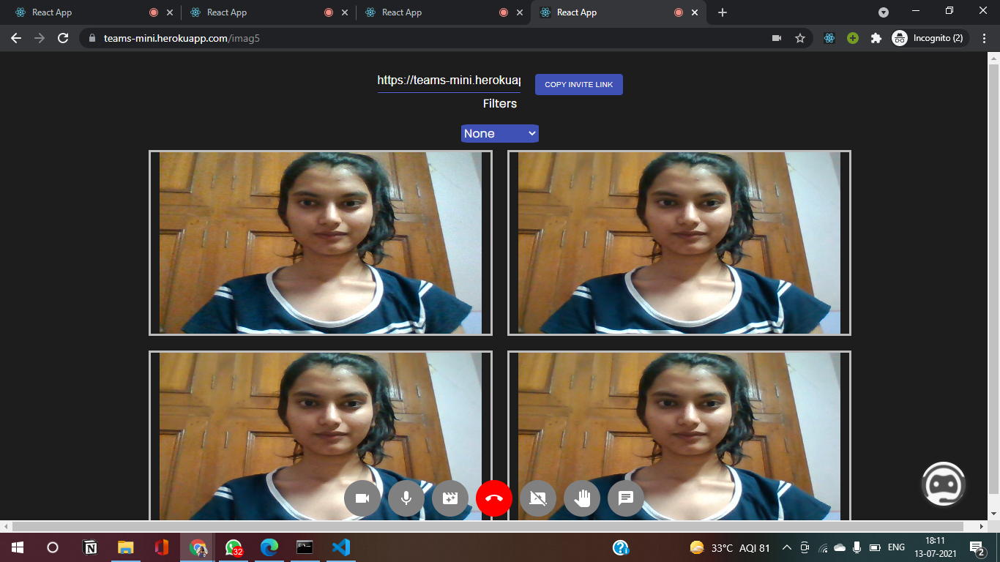
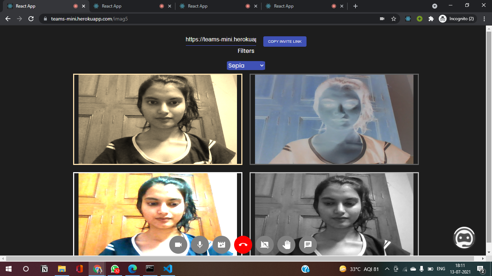
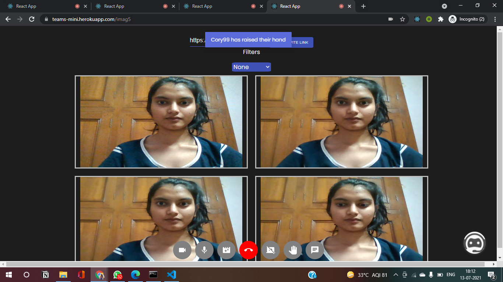
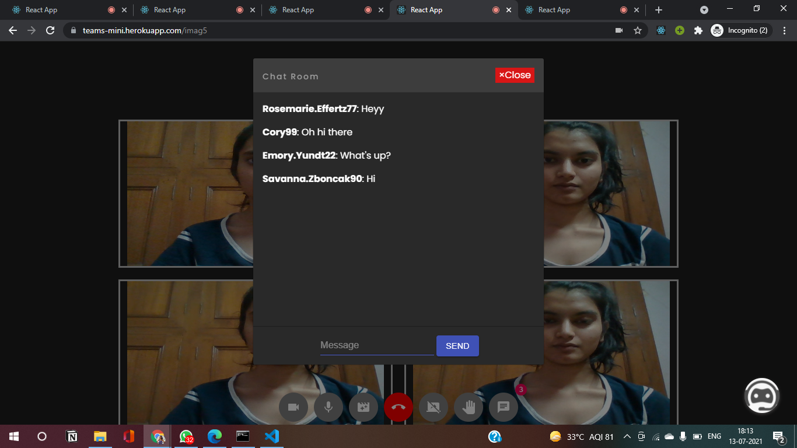
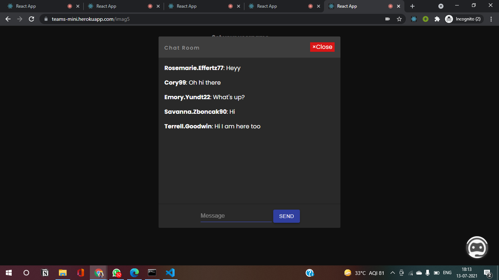
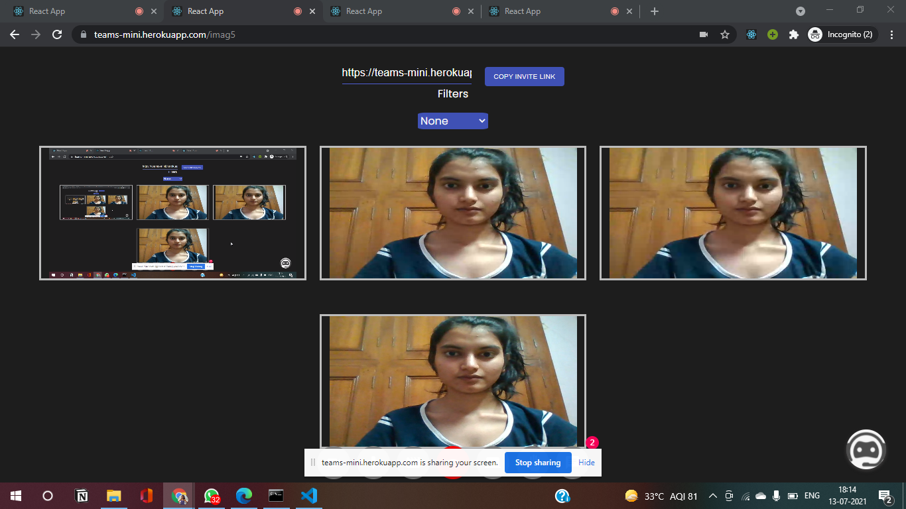
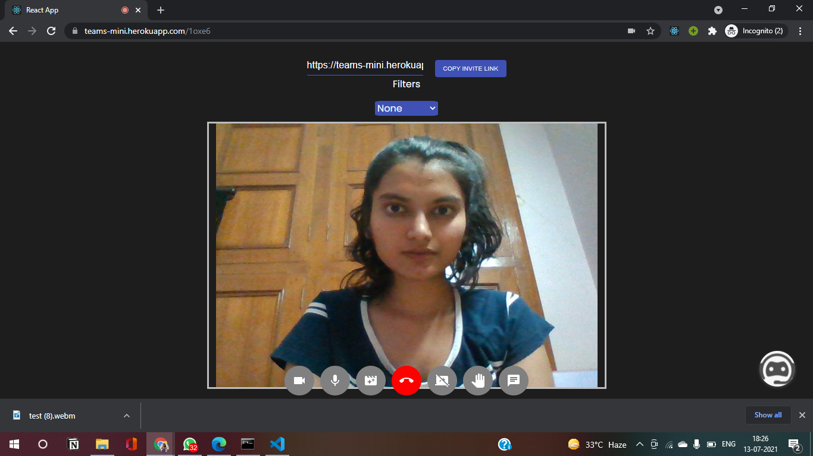

# Microsoft Engage 2021

## Problem statement

### Minimum Functionality

To build a fully functional prototype with at least one mandatory functionality -
a minimum of two participants should be able connect with each other using the product to have a video conversation.

### Adopt feature:

Include a chat feature in your application where meeting participants can share info without disrupting the flow of the meeting.
Through this feature the participants should be able have conversation befor joining, while in the meet and after leaving the meeting.

## Agile Methodology and Approach to Build the Project

I have followed **Agile Scrum Methodology** to build this project. 
**Agile Scrum Methodology** is a project management method that is best used to improve the project in every iteration.
Each iteration has sprints, where the goal in each sprint is to build the most important feature first and then improve the project as a potentially deliverable product.
Microsoft has provided us with sprints :**Design, Build, Adopt** which are 1-2 weeks each. 
I also used a scrum board on trello to track my progress during ongoing sprints.
I divided my project in four sprints of one week each.
They are:

### Sprint 1

- Research about WebRTC
- Initializing a server and a starting web page.
- Adding the ability to stream my own video
- Connecting other clients and ability to see their video.
- Basic Styling

### Sprint 2

- Toggling mic button to turn off audio
- Toggling video camera button to turn off video

### Sprint 3

Worked on miscellaneous features like

- Hand-Raise
- Video record and download
- Screen Sharing
- Real-time video filters

### Sprint 4

- Worked on the adopt functionality
- Created a basic FAQ chatbot
- Deployed the application on Heroku
- Final UI touches

## Tech Stack used

- React.JS(for client-side)
- Node.JS and Express.JS(on server side)
- WebRTC
- Socket.IO(for webRTC signalling server)
- Dialogflow and Kommunicate.io(for FAQ chatbot)

## Features

- Multi-user video conferencing
- Connect on the go-no authentication required
- Chat before entering the video meet, during the meet and after exiting the meet
- Notifications whenever a user joins,exits the call or sends a message
- Video and mic toggling
- Screen sharing
- Video record and download
- Real-time video filters
- Hand-raise
- Copying the meet link to clipboard
- And an FAQ chatbot

## Screenshots

### Multi user video-conferencing

### Realtime video filters!

### Raise Hand for attention

### Chat during the meet

### Chat before and after the call

### Screen sharing

 
 ### Video Recording and download
 